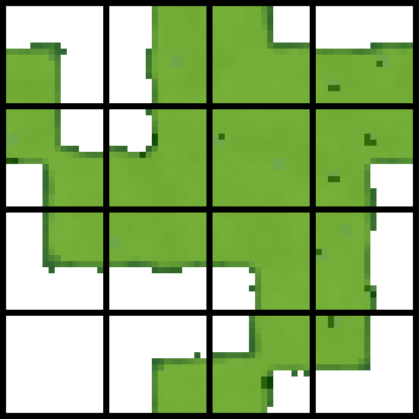
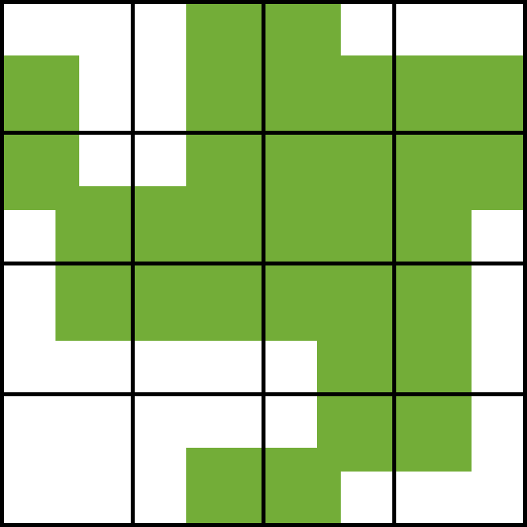
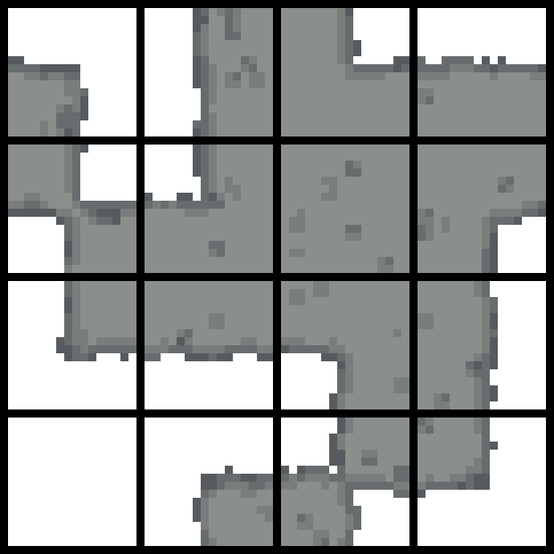
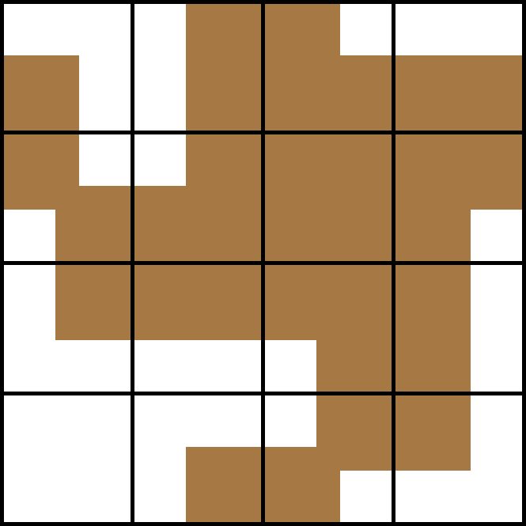
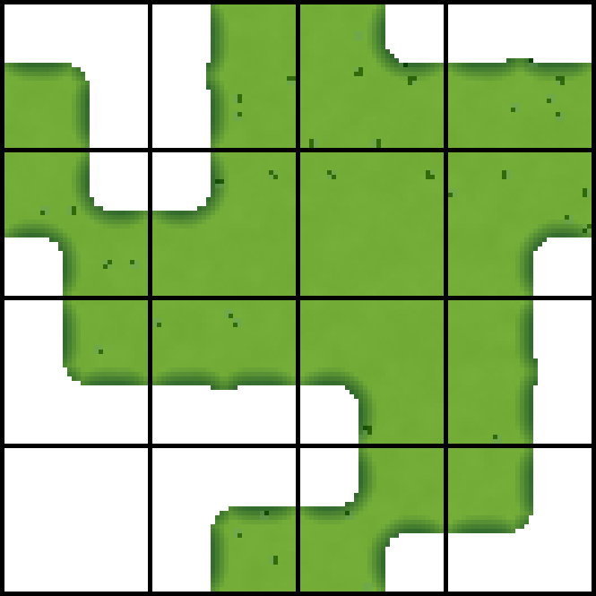
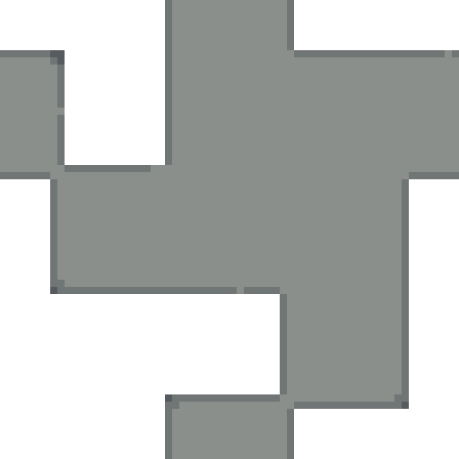
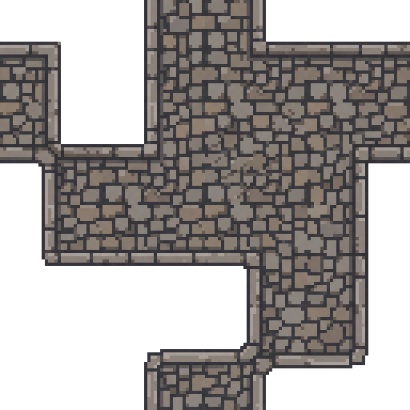

# SpriteCook Tileset Base Generator

A tiny browser tool that draws 15-piece and 17-piece base shapes for a top-down tileset from scratch, with math. Pick a tile size, tune the edges and colors, and export a pixel-perfect PNG. No build step, no dependencies, one HTML file.

## What it makes

Most top-down terrain tilesets share a compact 4x4 layout. Sixteen tiles cover every way grass can meet not-grass at the four corners, and one of them is empty, so you get 15 usable pieces. Drop them next to each other and the terrain connects seamlessly in any direction. The tool also includes a 17-piece 5x5 guide layout with a single tile, vertical stroke, horizontal stroke, 3x3 island, and four-way inner-corner helper.

This tool generates that exact layout as a clean base shape:

Each tile is built from filled quadrants. Where a filled quadrant meets a tile edge it bleeds right up to the border so neighbors connect. Where it faces empty space you get the silhouette, and that is the only place rounding and rough edges show up. Diagonal tiles bridge through the center instead of pinching at a point, which is what keeps the terrain readable.

## Why this exists

It started as a helper for AI tileset generation. A good reference image tells the model two things at once: the pixel density to work at, and the shape each tile needs to be. Hand-drawing that reference every time is slow. This generates it from settings in a second, so you can get the structure right first and add detail later.

## Try it

Open `index.html` in any browser. That is the whole tool. You can also drop it on any static host (GitHub Pages, Netlify, an S3 bucket) since it is a single self-contained file.

## Examples

| Grass, 16px, rough edges | Stone, 16px | Wood, clean straight edges | Grass, clean with rounded corners |
| --- | --- | --- | --- |
|  |  |  |  |

The `examples/` folder has both the upscaled previews (`@Nx`) and the raw native PNGs. `examples/_gen.py` is a Python port of the same rendering math that produced them, so the output is reproducible outside the browser.

## Controls

- **Tile size** 16, 32, or 64 pixels per tile.
- **Tileset** switches between the compact 15-piece 4x4 sheet and the 17-piece 5x5 guide sheet.
- **Corner radius** rounds the silhouette. Convex corners round outward, the inner corners of notch tiles round inward by the same amount. Set it to 0 for hard pixel corners.
- **Tile padding** in 17-piece mode controls the distance from open tile edges, including the inner-corner helper cutouts.
- **Edge style** rough for an organic, hand-placed look, clean for straight lines (good for floors, paths, anything man-made).
- **Edge noise** how far the rough edge wobbles.
- **Noise size** the scale of that wobble, smaller is finer.
- **Base color / Edge color** the fill and the darker rim it fades into.
- **Edge fade** how many pixels the rim color reaches in from the silhouette. It follows the real grass-to-empty edge only, never the seams or the connecting edges.
- **Texture noise** subtle light and dark variation across the fill.
- **Flecks / Pixel clusters** scattered darker specks for a bit of grit.
- **Seed** changes the random pattern. Hit **New seed** to roll a fresh one.
- **White bg / Black grid** toggle the background and the 1px grid lines between tiles.
- **1024 upscale** export a nearest-neighbor 1024px version on top of the native one.
- **Download PNG** saves what you see.

## Output sizes

Output is true pixel size, not a blurry blow-up. A 16px 15-piece tileset is 64x64 pixels (four 16px tiles). Turn on the black grid and it becomes 69x69, because the grid adds five 1px separators around and between the tiles. The 17-piece sheet is 80x80 without grid or 86x86 with grid at 16px. The preview shows those exact pixels scaled up with nearest-neighbor so you can see what you are editing. The optional 1024 upscale is there for tools that want a larger reference.

## How it works

In 15-piece mode, each of the 16 tiles is a corner mask. The four corners are either filled or empty, which gives 16 combinations. The grass region is the union of the filled quadrants, expanded slightly past center so adjacent corners overlap and diagonals connect. In 17-piece mode, rectangular stroke and island pieces use padding-aware rounded boxes, and the helper tile carves small concave cutouts from all four corners. Edge noise and texture come from seeded value noise, so the same seed always gives the same tileset.

## License

MIT. See [LICENSE](LICENSE). Use it however you like. It is provided as is, with no promise of support, maintenance, or future updates.

## Made with SpriteCook

We built this at [SpriteCook](https://www.spritecook.ai) because a clean base shape is the best starting point for generating a detailed tileset with AI. The base sets the resolution and the silhouette, then the model fills in the texture.

Here is a stone base from this tool next to the cobblestone SpriteCook generated from it. Same resolution, same 15-piece layout, so the detailed tiles still connect.

| Base from this tool | Detailed with SpriteCook |
| --- | --- |
|  |  |

Make your own at [spritecook.ai](https://www.spritecook.ai).
